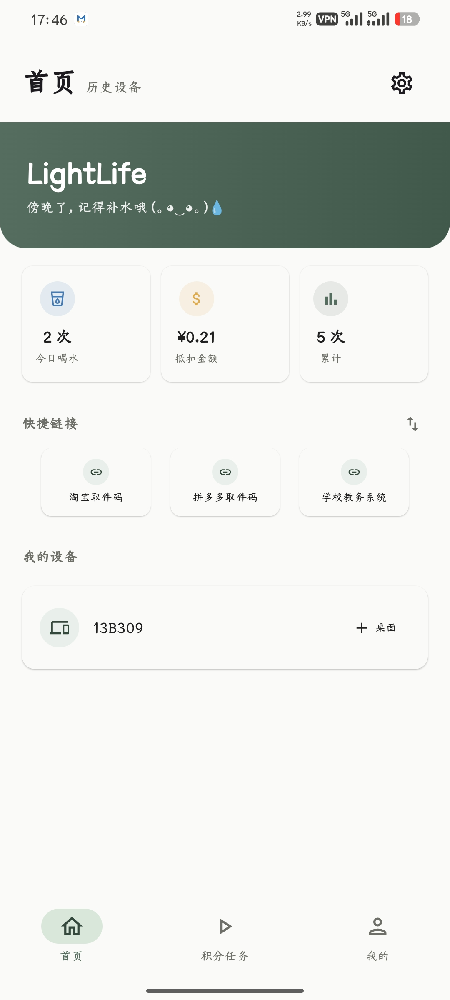
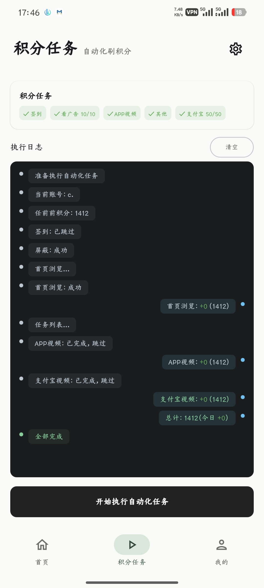
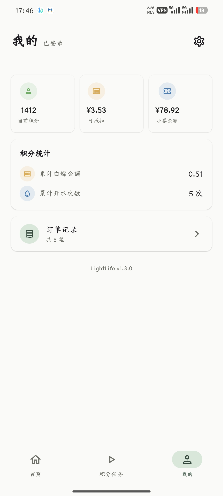

# LightLife

集成了胖乖生活开水功能和刷积分脚本。安装包包体积仅约 **2MB**。轻量无广告，启动快速

基于 [wzs0512/qiekj-android](https://github.com/wzs0512/qiekj-android) 重构而来

---

## 功能预览

<p align="center">
  
  
  
</p>

---

## 功能

### 一键开水
选择历史设备，点击即可启动饮水机，订单自动保存并展示详情。

### 自动刷积分
签到、浏览任务、看视频一键执行，智能跳过已完成和失败任务，中断后重跑从上次进度继续。

- **后台执行**：无需停留在前台，通知栏展示任务进度
- **自动执行**：启动App后自动检测并执行未完成任务（默认关闭，可在设置中开启）

### 快捷方式
内置三个预设：
- 淘宝取件码
- 拼多多取件码
- 学校教务系统

支持自定义编辑，长按卡片可添加到手机桌面。

### 数据统计
实时查看积分余额、订单记录、累计白嫖金额。

### 数据备份
支持导出/导入 `.lif` 备份文件，换机可实现无需验证码直接登录，保留日志及订单数据。

### 安全功能
- **保险模式**：开启后完全禁用积分脚本，适合担心账号风险的用户
- 一键清除所有记录和日志

### 其他
- 主题支持：跟随系统 / 浅色 / 深色
- 触感反馈：按钮和开关操作附带振动
- 执行日志持久化，支持查看历史记录

---

> [!CAUTION]
> 本项目为个人兴趣开发，**仅供学习和测试使用**。
>
> 自动化积分功能模拟正常用户操作流程，可能违反相关平台服务条款。请自行承担账号、设备、接口变更和平台规则风险，可能面临账户**积分清零**、**永久无法使用积分**甚至**封号**的风险。
>
> 若担心风控，可仅使用饮水设备解锁功能，不启用自动化积分脚本。如仍不放心，请勿下载本软件。
>
> **下载即视为接受以上声明条款，本人概不承担因此产生的任何责任。**

---

## 使用方法

### 登录
1. 进入「我的」页面，输入手机号发送验证码
2. 输入验证码确认登录，Token 自动保存

### 开水
1. 首页等待设备列表加载
2. 选择目标设备，点击「开水」即可

### 刷积分
1. 进入「积分任务」页面，点击「开始执行自动化任务」
2. 任务中断后重新执行会智能跳过已完成的步骤
3. 支持后台执行，切换到其他应用或锁屏继续工作
4. 设置中可开启「自动执行」，启动App后自动处理未完成任务

### 快捷方式
1. 进入快捷方式页面，选择预设或自定义
2. 长按卡片 → 「添加到桌面」

### 数据备份
1. 进入设置 → 数据备份 → 导出备份
2. 新设备安装后，在登录页面选择「导入备份登录」即可免验证码登录

---

## 技术栈

| 类别 | 技术 |
|------|------|
| 语言 | Kotlin |
| UI 框架 | Jetpack Compose + Material3 |
| 网络 | OkHttp + Retrofit |
| 序列化 | Moshi |
| 存储 | SharedPreferences + JSON 文件 |
| 构建 | Gradle + AGP 8.7.3 |
| 后台服务 | ForegroundService + Notification |

---

## 项目结构

```
app/src/main/java/com/inonvation/lightlife/
├── MainActivity.kt      # 应用入口
├── data/                # 数据层（API、存储、任务执行）
├── ui/                  # UI 层（ViewModel、页面、组件）
│   └── screen/          # 各功能页面
```

---

> [!NOTE]
> - Token 随手机号重新登录而变化，App 自动保存最新 Token
> - **不要将个人 Token、调试签名、API 密钥上传到公开仓库**

---


## 参与贡献

欢迎提交 Issue 反馈问题或建议，也欢迎 Fork 后提交 Pull Request。

---

## 致谢

- [3ryng1um/qiekj](https://github.com/3ryng1um/qiekj) — 提供了积分自动化脚本及饮水设备解锁的接口分析与流程框架
- [wzs0512/qiekj-android](https://github.com/wzs0512/qiekj-android) — 提供了原始 Android 客户端的框架结构与项目基础
- [Alpaca4610/nonebot_plugin_pgsh_sign](https://github.com/Alpaca4610/nonebot_plugin_pgsh_sign) — 提供了胖乖生活签到、首页浏览子任务及支付宝任务的 API 接口分析
- [incompletecactus/PG](https://github.com/incompletecactus/PG) — 提供了支付宝视频任务及广告任务的接口与签名逻辑
- [3288588344/toulu](https://github.com/3288588344/toulu) — 提供了胖乖生活自动化脚本参考

---

## 许可证

[MIT License](LICENSE)
